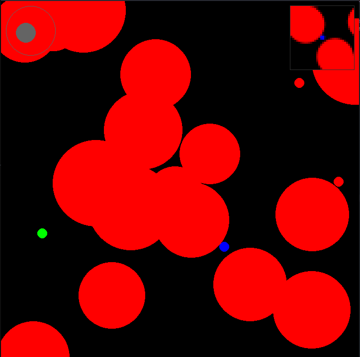

# Project Columbus

<p align='center'>
  
</p>

Project Columbus is a framework for trivial 2D OpenAI Gym environments that are supposed to test a agents ability to solve tasks that require different forms of exploration effectively and efficiently.

## Installation

(If you want to install Columbus as a dependency for metastable-baselines, activate (source) the venv from metastable-baselines before running this command.)

```
pip install -e .
```

### env.py

  
Contains the ColumbusEnv.
There exist two ways to implement new envs:

- Subclassing ColumbusEnv and expanding _init_ and overriding _setup_.
- Using the ColumbusConfigDefined with a desired configuration. This makes configuring ColumbusEnvs via ClusterWorks2-configs possible. (See ColumbusConfigDefinedExample.md for an example of how the parameters are supposed to look like (uses yaml format), I don't have time to write a better documentation right now...)

##### Some caveats / infos

- If you want to render to a window (pygame-gui) call render with mode='human'
- If you want visualize the covariance you have to supply the cholesky-decomp of the cov-matrix to render
- If you want to render into a mp4, you have to call render with a mode!='human' and assemble/encode the returned frames yourself into a mp4/webm/...
- Even while the agent plays, some keyboard-inputs are possible (to test the agents reaction to situations he would never enter by itself. Look at \_handle_user_input in env.py for avaible keys)
- The sampling-rate of the physics engine is bound to the frame-rate of the rendering engine (1:1). This means too low fps / too fast agents / too thin barriers will lead to the agent tunneling through barriers. You can fix this by setting a higher agent-drag (which decreases the maximum speed) or making barriers thicker. A feature allowing the physics engine to sample multiple smaller steps within a single rendering step could be added in the future.

### entities.py

Contains all implemented entities (e.g. the Agent, Rewards and Enemies)

### observables.py

Contains all 'oberservables'. These are attached to envs to define what kind of output is given to the agent. This way environments can be designed independently from the observation machanism that is used by the agent to play it.

##### Some caveats

- CNNObservable seems to be broken currently. (Fixing it is also no priority for me)
- RayObservable is using a naive ray-marching (basicaly just line-sweeping). For large amounts of rays this turn out to be the computational bottleneck of the environment. Switching to a more efficient algorithm (based on euclidean formulars and line intersects) would be possible in the future...

### humanPlayer.py

Allows environments to be played by a human using mouse input. Now even works for ColumbusConfigDefined.
